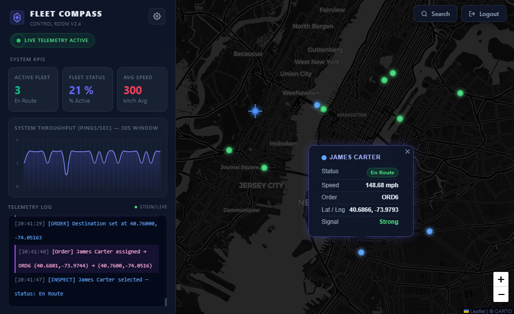

<div align="center">

# 🧭 FLEET COMPASS

**Enterprise-grade logistics & telematics simulation platform for high-concurrency fleet management**

[](https://opensource.org/licenses/MIT)
[](https://nodejs.org/)
[](https://nestjs.com/)
[](https://react.dev/)
[](https://www.typescriptlang.org/)
[](https://www.docker.com/)

</div>

---

## 📸 Preview

<!-- TODO: Replace this with an actual screenshot of the Control Room UI -->
<div align="center">
  
  <p><em>Control Room — real-time asset tracking and dispatch view</em></p>
</div>

---

## 📖 Overview

**FLEET COMPASS** is an advanced logistics and telematics simulation platform built for high-concurrency fleet management. It provides a digital-twin **"Control Room"** where operators can orchestrate complex logistics workflows, visualize live geospatial telemetry, and manage automated dispatching in real time.

The platform is built for resilience and performance, using asynchronous job processing to simulate real-world movement across multiple concurrent assets with high precision — making it ideal for training environments, dispatch simulations, and logistics R&D.

---

## ✨ Key Features

- **🛰️ Real-Time Simulation & Mapping**
  Live geospatial tracking powered by **Socket.io** for real-time asset streaming, with route pathing rendered via **Leaflet.js**.

- **⚙️ Asynchronous Logistics Processing**
  **BullMQ** + **Redis** handle queuing, caching, and processing of complex routing requests via **OpenRouteService**, enabling seamless concurrent multi-driver trip simulations.

- **📊 Advanced Telemetry & Status Tracking**
  Granular visibility into driver availability, live trip progress, and complete historical route logs.

- **🔒 Hardened Security Architecture**
  Zero-trust design with HTTP-only cookies, automated rate-limiting (throttling), and a secure one-time-use password recovery flow.

- **✉️ Communication Layer**
  Integrated **Nodemailer** workflows for automated system alerts and secure email confirmations.

- **🖥️ Control Room UI**
  A premium, high-contrast dark-mode (`slate-950`) interface with modern glassmorphism, designed to keep operators focused during high-intensity monitoring.

---

## 🛠️ Technology Stack

| Layer | Technology |
|---|---|
| **Frontend** | React, TypeScript, Tailwind CSS, Leaflet.js |
| **Backend** | NestJS (REST API + WebSockets) |
| **Database & Auth** | Supabase (PostgreSQL + Auth Engine) |
| **Queue & Cache** | BullMQ, Redis |
| **Integrations** | OpenRouteService (Geo-routing), Nodemailer (Mail) |
| **Infrastructure** | Docker (containerized development) |


---
 
## 📂 Project Structure
 
```
┣ 📂fleet-compass-backend
┃ ┣ 📂src
┃ ┃ ┣ 📂database
┃ ┃ ┣ 📂fleet
┃ ┃ ┃ ┣ 📂dto
┃ ┃ ┃ ┣ 📂entities
┃ ┃ ┃ ┣ 📜fleet-events.service.ts
┃ ┃ ┃ ┣ 📜fleet.controller.ts
┃ ┃ ┃ ┣ 📜fleet.gateway.ts
┃ ┃ ┃ ┣ 📜fleet.module.ts
┃ ┃ ┃ ┣ 📜fleet.service.ts
┃ ┃ ┃ ┣ 📜location.processor.ts
┃ ┃ ┃ ┗ 📜route.processor.ts
┃ ┃ ┣ 📂types
┃ ┃ ┣ 📂user
┃ ┃ ┃ ┣ 📂dto
┃ ┃ ┃ ┣ 📂entities
┃ ┃ ┃ ┣ 📜auth.guard.ts
┃ ┃ ┃ ┣ 📜user.controller.ts
┃ ┃ ┃ ┣ 📜user.module.ts
┃ ┃ ┃ ┗ 📜user.service.ts
┃ ┃ ┣ 📜app.controller.ts
┃ ┃ ┣ 📜app.module.ts
┃ ┃ ┣ 📜app.service.ts
┃ ┃ ┗ 📜main.ts
┃ ┃ ┣ 📜.gitignore
┃ ┣ 📜Dockerfile
┣ 📂fleet-compass-frontend
┃ ┣ 📂public
┃ ┣ 📂src
┃ ┃ ┣ 📂api
┃ ┃ ┃ ┗ 📜client.ts
┃ ┃ ┣ 📂lib
┃ ┃ ┃ ┗ 📜supabase.ts
┃ ┃ ┣ 📜AddDriverModal.tsx
┃ ┃ ┣ 📜App.css
┃ ┃ ┣ 📜App.tsx
┃ ┃ ┣ 📜Components.tsx
┃ ┃ ┣ 📜ConfirmProcessing.tsx
┃ ┃ ┣ 📜DispatchPopup.tsx
┃ ┃ ┣ 📜FleetCompassApp.tsx
┃ ┃ ┣ 📜FleetCompassAuth.tsx
┃ ┃ ┣ 📜ForgotPassword.tsx
┃ ┃ ┣ 📜index.css
┃ ┃ ┣ 📜KpiCard.tsx
┃ ┃ ┣ 📜Layout.tsx
┃ ┃ ┣ 📜LeafletMap.tsx
┃ ┃ ┣ 📜main.tsx
┃ ┃ ┣ 📜NotFound.tsx
┃ ┃ ┣ 📜SearchPanel.tsx
┃ ┃ ┣ 📜Settings.tsx
┃ ┃ ┣ 📜Terminal.tsx
┃ ┃ ┣ 📜ThroughputChart.tsx
┃ ┃ ┣ 📜TopBar.tsx
┃ ┃ ┣ 📜TripWizard.tsx
┃ ┃ ┣ 📜types.ts
┃ ┃ ┗ 📜UpdatePassword.tsx
┃ ┣ 📜.gitignore
┃ ┣ 📜Dockerfile
┃ ┣ 📜eslint.config.js
┃ ┣ 📜index.html
┃ ┣ 📜package.json
┃ ┣ 📜postcss.config.js
┃ ┣ 📜README.md
┃ ┣ 📜tailwind.config.js
┃ ┗ 📜vite.config.ts
┣ 📜.dockerignore
┣ 📜.env
┣ 📜.gitignore
┣ 📜docker-compose.yml
┗ 📜README.md

```
---

## 🏗️ Architecture

```
    ┌────────────────┐      WebSockets      ┌────────────────────┐
    │  React Client  │ ◄──────────────────► │   NestJS Backend   │
    │  (Leaflet.js)  │        REST API      │  (WS Gateway/API)  │
    └────────────────┘ ◄──────────────────► └─────────┬──────────┘
                                                      │
    ┌──────────────────────────────┌──────────────────└───────────┐
    ▼                              ▼                              ▼
┌───────────────┐             ┌────────────────┐             ┌────────────────┐
│  Supabase     │             │  BullMQ/Redis  │             │  Nodemailer /  │
│(Postgres/Auth)│             │  Job Queue     │             │OpenRouteService│
└───────────────┘             └────────────────┘             └────────────────┘
```

---

## 🚀 Getting Started

### Prerequisites

- [Node.js](https://nodejs.org/) v20+
- [Docker](https://www.docker.com/) & Docker Compose
- A [Supabase](https://supabase.com/) project
- An [OpenRouteService](https://openrouteservice.org/) API key
- Redis (or use the provided Docker service)

### Installation

```bash
# 1. Clone the repository
git clone https://github.com/<your-username>/fleet-compass.git
cd fleet-compass

# 2. Install dependencies
npm install

# 3. Configure environment variables
cp .env.example .env
# then fill in the values (see below)

# 4. Start supporting services (Redis, etc.)
docker compose up -d

# 5. Run database migrations (if applicable)
npm run migrate

# 6. Start the development server
npm run dev
```

### Environment Variables

Create a `.env` file based on `.env.example`:

```env
# Supabase
VITE_SUPABASE_ANON_KEY=
VITE_SUPABASE_URL
SUPABASE_URL=
SUPABASE_SERVICE_ROLE_KEY=
DATABASE_URL=

# Redis / BullMQ
REDIS_HOST=localhost
REDIS_PORT=6379

# OpenRouteService
ORS_API_KEY=

# Mail (Nodemailer)
SMTP_USER=
SMTP_PASSWORD=

# App
PORT
CLIENT_URL=http://localhost:3000
```

---

## 🐳 Docker Deployment

```bash
docker compose up --build
```

This spins up the frontend, backend, Redis, and any auxiliary services defined in `docker-compose.yml`.


<div align="center">
  <sub>Built with ⚡ for high-concurrency fleet operations.</sub>
</div>